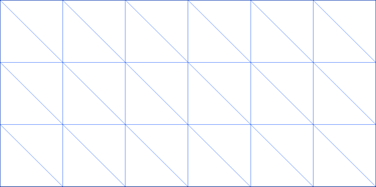
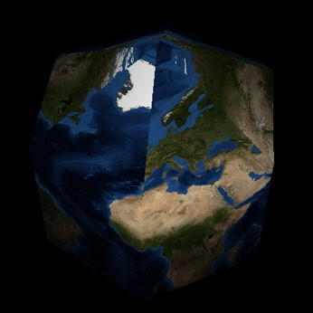

# Assignment 3: Earthquake Visualization

**Due: Monday, February 28, 11:59pm CDT**

For this assignment, you will be working with data from NASA and the USGS to visualize on a globe the locations where earthquakes happened between 1905 and 2007.

Visualizations incorporating geospatial data are used and analyzed in many different contexts, including navigating a city (as seen in GPS devices), commercial development, and setting governmental policy. This area also receives a significant amount of research attention. For example, Prof. Vipin Kumar and others at the University of Minnesota are working on visualizing and understanding global warming datasets as part of an [NSF project](http://climatechange.cs.umn.edu).

Your application will be able to morph between two complementary views of the data, a 2D map view and a 3D globe view, as shown below.  You can also try out the instructor's [complete implementation](https://csci-4611-spring-2022.github.io/Builds/Assignment-3) in the Builds repository on the course GitHub. 

 

The earthquake dataset you will be using includes 13,540 different earthquakes. The Earth texture dataset from NASA is available in resolutions down to 500m/pixel, although getting this to display on your graphics card is well beyond the scope of this assignment.

In this assignment, you will learn to:

- Visualize real-world geographical data on a 3D textured globe.
- Apply textures to 3D objects.
- Algorithmically create a deforming 3D mesh and display it using vertex buffers.
- Define normal vectors and texture coordinates for a sphere.
- Convert from spherical coordinates (latitude and longitude) to 3D Cartesian coordinates.

## Submission Information

You should fill out this information before submitting your assignment. Make sure to document the name and source of any third party assets that you added, such as models, images, sounds, or any other content used that was not solely written by you. 

Name: Calvin Tran

Third Party Assets:

Wizard Bonus Functionality:

## Prerequisites

To work with this code, you will first need to install [Node.js](https://nodejs.org/en/) and [Visual Studio Code](https://code.visualstudio.com/). 

## Getting Started

The starter code implements the general structure that we reviewed in lecture.  After cloning your repository, you will need to set up the initial project by pulling the dependencies from the node package manager with:

```
npm install
```

This will create a `node_modules` folder in your directory and download all the dependencies needed to run the project.  Note that this folder is `.gitignore` file and should not be committed to your repository.  After that, you can compile and run a server with:

```
npm run start
```

The build system should launch your program in a web browser automatically.  If not, you can run it by pointing your browser at `http://localhost:8080`.

## Earth and Earthquake Data

We have included multiple scaled-down versions of this Earth texture with the code distributed on the website, since you need a fairly powerful computer to render even the lowest-quality image from the NASA page. In order of decreasing quality, the following images are provided:

- earth-2k.png: 2048×1024 version of image
- earth-1k.png: 1024×512 version of image
- earth-512.png: 512×256 version of image
- earth-256.png: 256×256 version of image

The [complete implementation](https://csci-4611-spring-2022.github.io/Builds/Assignment-3) uses the 2k version of the texture, and switches to the 1k version whenever the viewport is less than 1000 pixels wide (the dynamic texture is not part of this assignment, and could be considered wizard functionality).  If this runs slowly on your computer, you should feel free to use a lower resolution version of the image. The Earth textures are stored in a [equirectangular projection](https://en.wikipedia.org/wiki/Equirectangular_projection), which simply means that the *x* coordinate corresponds directly to longitude and *y* directly to latitude.

The earthquake dataset contains information about the earthquake's magnitude (a measure of severity) and its longitude and latitude. This data has already been loaded into `EarthquakeRecord` objects by the `EarthquakeDatabase` class.  You will be required to display the earthquakes at the correct locations with animations through time. More information on the earthquakes is available in the data file, and if you are interested in potential wizard ideas, you can try to figure out ways to integrate additional data variables into your visualization.

## Program Requirements

You will be required to write the code that displays the Earth on screen and animates it between flat rectangular map and a three-dimensional globe. You will also need to write the code to display the earthquakes on the Earth. The starter code defines a single directional light source at position (10,10,15).  If your normals are defined correctly, you will see some brighter lighting on the top-right portion of the globe, while the bottom-left portion will appear dark.

#### 1. Creating the Flat Map Mesh

Use the `THREE.Mesh` class to draw a rectangle subdivided into multiple triangles, representing a flat map of the Earth. The Flat Map Mesh should:

- Lie in the *xy* plane.
- Have *x* values ranging from −*π* to *π*.
- Have *y* values ranging from −*π*/2 to *π*/2.
- Be divided into *n* columns horizontally and *m* rows vertically. (You will find these constants in the code. Note that this will produce (*n*+1)×(*m*+1) vertices and 2×*n*×*m* triangles.)



The best way to go about this is to start with a small example and then build up from there. We recommend:

- Above is an example with 6 columns and 3 rows. Study how vertices are connected into triangles here.
- Work out the indices on paper by hand for a similar small example, say *n* = 4, *m* = 2. Draw a picture, numbering the vertices and develop your own indices array based on your picture.
- When you have the concept down, recreate your picture in code inside the `Earth.initialize()` method.  Call `this.earthMesh.geometry.setAttribute()` to set your vertex array and `this.earthMesh.geometry.setIndex()` to set your index array.  As a demonstration, a square with 4 vertices and 2 triangles has been implemented in the starter code to show you how to use these functions.
- To check your work, try clicking on the "Debug Mode" checkbox in the app. This can be very useful when debugging – it draws the edges of each triangle in the mesh so that you can more easily see what is going on.
- When your simple example is working, increase the number of rows and columns.  Make sure your *x* and *y* values follow the ranges mentioned above.  You will want the number of vertices to be large enough so that the mesh can be morphed into a reasonable-looking sphere in a later part of this assignment   However, if you make the mesh too large, it will slow down the rendering.
- At this point, we also recommend that you clean up your code a bit. At some point in your code, you will have needed to convert a latitude and longitude to a (x,y,z) point. If you have not done so already, move this code into the function called `Earth.convertLatLongToPlane()`. This will make it easier for you to use the same code later to find the correct positions for earthquakes.

#### 2. Creating the Flat Map Normals

In computer graphics, vertex normals need to be defined for lighting calculations. For each vertex in the flat map, the normal should be the vector pointing directly outward towards the camera (0, 0, 1).  An example for the single square mesh is also provided in the starter code.  The array of normals should be exactly the same length as the vertex array, so you will need to expand the array based on the size of your mesh.

#### 3. Texturing the Mesh

In the starter code, the Earth texture is loaded and assigned to the example mesh.  However, it won't be displayed until you define the texture coordinates. We will go over this in class, but as a reminder, each vertex requires two coordinates, *u* and *v*, each of which should be a value between 0 and 1.

-  Assuming the *u* and *v* values are stored in an array called `texCoords`, you can assign them to the mesh with the following line of code:

```typescript
this.earthMesh.geometry.setAttribute('uv', new THREE.Float32BufferAttribute(texCoords, 2));
```

#### 4. Displaying the Earthquakes

Display on the Earth all the earthquakes that have happened within the past one year of the current visualization time.  The basic structure for this is already implemented; you just need to uncomment a line of code in the `QuakeVis.update()` method to start drawing earthquake markers.  However, their positions will initially be placed randomly.

- Use your `Earth.convertLatLongToPlane()` method to obtain the earthquake positions such that they match the texture (i.e., an earthquake occurring in California must be displayed in the same location as the California of the Earth texture). One way to tell if your mapping is correct is if you see a lot of earthquakes along the "Ring of Fire" in the Pacific Ocean off the coast of Asia.
- You may use a sphere to draw the earthquake markers or come up with your own custom geometry. Earthquake sizes and colors should be based on the earthquake data in some meaningful way. For example, the instructor's implementation used `lerp()` functions to adjust the radius (between some predefined minimum and maximum) and color (between yellow to red) of the sphere based on the magnitude.
- In the instructor's implementation, the earthquakes markers are animated to gradually shrink before they are removed from the scene.  The size animation is not necessary for this assignment and could be considered as wizard functionality.  

#### 5. Creating the Globe Mesh Geometry

Create a second array of vertex positions to draw the Earth as a sphere instead of a rectangle.

- Complete the `Earth.convertLatLongToSphere() ` method.  If you use this to version when creating your mesh, you should end up with sphere geometry instead of a flat map. The mesh connectivity (i.e., the indices that define the triangles) and texture coordinates **do not need to change** when from moving from a plane to a sphere. Only the vertex positions need to change.
- You will need to convert latitude and longitude into the three-dimensional Cartesian coordinates of the corresponding point on the sphere, using the following formulas:
  - **x** = cos(**lat**) × sin(**lon**)
  - **y**= sin(**lat**)
  - **z** = cos(**lat**) × cos(**lon**)


- Be careful to take note that the latitude and longitude in the input file are in degrees, not radians. You can convert them to radians by multiplying by `Math.PI / 180`.

- The texture is permitted to look slightly "cut off" *only* at the top and bottom stack of the Earth mesh. The image below shows what this looks like when *columns* = 6 and *rows* = 3.  Increasing the number of rows and columns will make this problem less obvious.



#### 6. Creating the Globe Mesh Normals

Create a second array of normals for the globe mesh.  Because you are now rendering a sphere, you will need to compute new normals to get the lighting on the globe to look good. For each vertex, the normal should be the normalized vector pointing from the center of the sphere (the origin) to the vertex position.  The array of normals should be exactly the same length as the vertex array. 

#### 7. Morphing Between the Map and Globe

Smoothly transform the mesh between the flat map and the globe based on user input. The program should start with the Earth displayed as a map. When the user changes the drop down box to "Globe," it should morph into a sphere. If the user changes it back to "Map," it should smoothly morph back to the flat plane.  A GUI event handler called `viewController.onChange()` is already implemented in the `createScene()` function, but you will need to fill in the code.

- To get started on this, you will want to store the parts of the mesh that change between the two representations (vertices and normals) as member variables within your Earth class rather than local variables within the `initialize()` method. This way, you will be able to refer to them later in your program.
- Once you have these values stored, try updating the mesh whenever the drop down box is changed. To update the mesh, you just need to call `this.earthMesh.geometry.setAttribute` again with the appropriate arrays for the vertices and normals.
- Once you have an abrupt transition working, try creating a smooth morph. Remember that the `update(deltaTime)` function should be used for any sort of physical simulation or animation. Inside that function, you should interpolate between the vertices for the map and for the globe based upon the elapsed time since you began the morph. Check out the `lerp()` functions described in the "Useful Math" section for help with this. (Technically, the correct normal of the interpolated shape is not simply the interpolation of the normals, but we may pretend it is for this assignment.)

If you reduce the value of *columns* and *rows* and then watch the mesh structure in debug mode as it interpolates between a rectangle and a sphere, you should be able to see why the texture appears to be cut off near the poles.

#### 8. Morphing the Earthquake Positions

Similar to the globe geometry, you will need to add member variables for the map and globe positions in the `EarthquakeMarker` class using the `Earth.convertLatLongToSphere()` method.  Both of these positions should be stored using `Vector3`, so you can use the `lerpVectors()` function described in the "Useful Math" section to morph between them at the same time as the map and globe.

- The earthquakes must appear on the sphere in the correct geographical locations.  However, note that they may not lie exactly on the mesh if it has too few rows and columns.

## Useful Math

Here are a few mathematical operations that are very common in graphics and may be useful for this assignment:

**Linear interpolation**: One way to blend smoothly between two values *x* and *y* (which could be reals, or vectors, or matrices, etc.) is to define a function in which the output varies continuously from *x* to *y* as a scalar parameter *alpha* goes from 0 to 1. This function is traditionally abbreviated "lerp."

- lerp(*x*, *y*, *alpha*) = *x* + *alpha* × (*y* − *x*)

Thus, for example:

- lerp(*x*, *y*, 0) = *x*

- lerp(*x*, *y*, 1) = *y*

- lerp(*x*, *y*, 0.5) = (*x* + *y*) / 2

Three.js provides `lerp()` functions for several of the built-in types, include scalars, vectors, and colors.  For example:

```typescript
// scalars
var result = THREE.MathUtils.lerp(x, y, alpha);

// vectors (this function modifies the calling object)
// x and y are vectors, alpha is a scalar
someVector.lerpVectors(x, y, alpha);

// colors (this function modifies the calling object)
// x and y are colors, alpha is a scalar
someColor.lerpColors(x, y, alpha)
```

**Clamping**: A concise way to constrain a value to lie in a specified interval [*a*, *b*] is to define a function clamp(*x*, *a*, *b*) which returns *a* if *x* ≤ *a*, returns *b* if *x* ≥ *b*, and returns *x* otherwise.  Three.js conveniently provides a clamp function, which would be called as follows:

```typescript
x = THREE.MathUtils.clamp(x, a, b)
```

**Rescaling**: Suppose you have a value *x* in the range [*xmin*, *xmax*], and you want to find the corresponding value in [*ymin*, *ymax*]. Observe that *x* − *xmin* lies in [0, *xmax* − *xmin*], and (*x* − *xmin*)/(*xmax* − *xmin*) lies in [0, 1], so the desired value is:

- *y* = *ymin* + (*ymax* − *ymin*) × (*x* − *xmin*) / (*xmax* − *xmin*)

## Rubric

Graded out of 20 points.  Partial credit is possible for each step.

1. Creating the flat map mesh (4)
2. Creating the flat map normals (1)
3. Texturing the mesh (2)
4. Displaying the earthquakes (2)
5. Creating the globe mesh geometry (4)
6. Creating the globe mesh normals (1)
7. Morphing between the map and globe (4)
8. Morphing the earthquake positions (2)

## Wizard Bonus Challenge

All of the assignments in the course will include great opportunities for students to go beyond the requirements of the assignment and do cool extra work. On each assignment, you can earn **one bonus point** for implementing a meaningful new feature to your program. This should involve some original new programming, and should not just be something that can be quickly implemented by copying and slightly modifying existing code.  

There are great opportunities for extra work in this assignment. For example:

- The source website for the Earth texture (see Data Credits below) has images for each month of the year. You could animate between the textures based upon the current time of year.
- We have also included a height text file that contains the elevation and bathymetry data for the Earth on an 8-bit scale (0-255, with sea level at 127, and 0 and 255 representing 8 km below and above sea level, respectively. You could use this data file to visualize the shape of the Earth's surface by displacing mesh vertices along their normals. You will need to use a higher resolution mesh to make this look good.  The instructor's implementation uses 200x200.
- You could adjust the model matrix for the earth to make it spin around and even apply an axial tilt (on average, the earth's axial tilt is about 23.4 degrees). 
- You could implement an animation for the earthquake markers. In the instructor's implementation, the markers gradually shrink in size. You could implement something similar or a completely different animation.
- Or, come up with a completely novel idea. Creativity is encouraged!

## Submission

When you commit and push your assignment to GitHub, an automated script will build and deploy the production code to the `gh-pages` branch of your repository.  However, your submission is not complete until you do the following:

1. Open your repository on GitHub and go to Settings->Pages.
2. Change the source to the `gh-pages` branch, then save.

You will need to wait a few minutes for the website to deploy.  After that, make sure to test everything by pointing your web browser at the link generated for your build:

```
https://csci-4611-spring-2022.github.io/your-repo-name-here
```

If your program runs correctly, then you are finished!  The published build will indicate to the TAs that your assignment is ready for grading.  If you change your mind and want to make further changes to your code, then just set the GitHub pages source back to `None` and it will unpublish the website.

Note that the published JavaScript bundle code generated by the TypeScript compiler has been minified so that it is not human-readable. So, you can feel free to send this link to other students, friends, and family to show off your work!

## Acknowledgments

Earthquake data was obtained from [USGS](http://earthquake.usgs.gov).  This data is in the public domain.
Credit: U.S. Geological Survey 
Department of the Interior/USGS

The Earth texture was obtained from [NASA](http://visibleearth.nasa.gov/view_cat.php?categoryID=1484). This data is in the public domain.
Credit: NASA Earth Observatory

The star background image was created by Jeremy Perkins on [Unsplash](https://unsplash.com/photos/uhjiu8FjnsQ).

This assignment was based on content from CSCI 4611 Fall 2021 by [Daniel Keefe](https://www.danielkeefe.net/).

## License

Material for [CSCI 4611 Spring 2022](https://canvas.umn.edu/courses/290928/assignments/syllabus) by [Evan Suma Rosenberg](https://illusioneering.umn.edu/) is licensed under a [Creative Commons Attribution-NonCommercial-ShareAlike 4.0 International License](http://creativecommons.org/licenses/by-nc-sa/4.0/).
